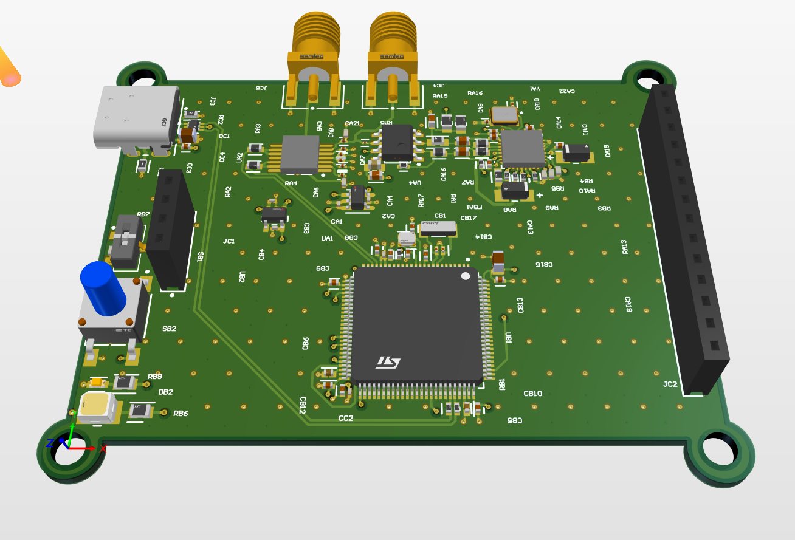

# 📈 Automatic High-Frequency Bode Analyzer & Plotter (AHFBAAPT)

**A standalone, embedded Bode plotter for ~₹8,000 — no PC, no software, just power and a DUT.**




---

## 🔎 Overview

Frequency response analysis usually means choosing between a lab-grade VNA (₹20k–₹2L), a bench scope + signal generator setup (slow and manual), or a PC-tethered NanoVNA. **AHFBAAPT** is a self-contained alternative: a hand-solderable, USB-C powered PCB that sweeps a signal through a device under test (DUT), measures magnitude and phase in real time, displays the result on an onboard touchscreen, and logs everything to a microSD card as CSV — with no computer required.

It's aimed at embedded engineers doing hardware bring-up, university labs teaching signals/RF courses, and hobbyists characterizing filters, inductors, and antenna matching networks.

## ✨ Key Features

- 📡 **Wide sweep range** — 10mHz to 100MHz, with 0.058Hz frequency resolution (32-bit tuning word)
- 🎯 **Accurate measurement** — ±30dB magnitude (±0.5dB accuracy) and 0°–180° phase (±1° accuracy)
- 🔢 **Up to 4096 log-spaced sweep points** per run
- 🔌 **Standalone operation** — no PC or companion software needed
- 🖥️ **2.4" touchscreen TFT** for real-time plotting and read-off of frequency/gain/phase at any point
- 💾 **microSD logging** — sweep results exported as CSV
- ⚡ **USB-C powered** (~300mA) and **USB-C data** for streaming/firmware updates
- 🛠️ **Open firmware** — full STM32 HAL access, easily extended (custom sweep profiles, Wi-Fi, USB streaming)
- 🧩 **Hand-solderable** 4-layer PCB build

## ⚙️ How It Works

The signal chain is a simple stimulus → measure → process pipeline:

1. **Stimulus** — The `AD9913` DDS synthesizer generates a swept sine wave from `f_start` to `f_stop` in log-spaced steps, driven by a 32-bit frequency tuning word.
2. **Measurement** — The `AD8302` gain/phase detector compares the DUT's output against the input and outputs two calibrated DC voltages: `VMAG` (30mV/dB) and `VPHS` (10mV/°).
3. **Processing** — The `STM32H750` reads both channels through its 12-bit ADC with 64× oversampling, converts the readings to dB/° (0.027dB/LSB), and updates the display and log in real time.


## 📊 System Specifications

| Parameter | Value |
|---|---|
| Frequency range | 10mHz – 100MHz |
| Frequency resolution | 0.058Hz (32-bit FTW) |
| Magnitude range | ±30dB (60dB total) |
| Magnitude accuracy | ±0.5dB |
| Phase range | 0° – 180° |
| Phase accuracy | ±1° |
| Sweep points | Up to 4096 (log-spaced) |
| Input impedance | 50Ω (SMA) |
| Display | 2.4" TFT, touch (ILI9341) |
| Storage | microSD, CSV export |
| Connectivity | USB-C (power + full-speed data) |
| Power | USB-C +5V, ~300mA |
| PCB | 4-layer, hand-solderable |

## 🧠 Key Components

| Chip | Role | Highlights |
|---|---|---|
| **AD9913BCPZ** | DDS Synthesizer | 250MSPS, 32-bit FTW, 10mHz–100MHz output, built-in linear sweep, SPI interface |
| **AD8302ARUZ** | Gain/Phase Detector | DC–2.7GHz input, ±30dB magnitude, 0°–180° phase, 30mV/dB & 10mV/°, single 5V supply |
| **OPA683ID** | High-Speed Op-Amp | I/V conversion (TIA), 72MHz low-pass filter, 50Ω output conditioning |
| **STM32H750VBT6** | MCU | 480MHz Cortex-M7, 12-bit ADC (64× oversample), 4× SPI (DDS/TFT/SD/touch), USB-C |

## 🔋 Power Architecture

Two regulated rails are derived from the USB-C +5V input:

- **TLV75533 → 3.3V digital** — powers the STM32, TFT, SD card, and USB
- **TLV75518 → 1.8V analog** — powers the AD9913 and AD8302
- A ferrite bead isolates the analog supply (VDDA) for a clean ADC reference, with separate ground pour planes and a star-point GND to keep digital switching noise off the analog rail


## 💰 Cost Breakdown (single unit, approx.)

| Item | Cost (₹) |
|---|---|
| STM32H750VBT6 | 665.71 |
| AD9913BCPZ (DDS) | 2,722.15 |
| AD8302ARUZ | 3,112.06 |
| OPA683ID | 468.96 |
| 2.4" TFT + ILI9341 | 500 |
| LDOs, passives, connectors | ≈500 |
| Crystal, etc. | 300 |
| **Total (all-in)** | **~₹8,270** |

For comparison, a comparable lab-grade VNA costs ₹20,000 – ₹13,00,000.

## 📁 Repository Contents

```
.
├── README.md                     # This file
├── pcb.png                       # Rendered/photographed PCB
├── diagrams/                     # Illustrative diagrams used in this README
│   ├── signal_chain_v2.png
│   └── power_architecture.png
├── pitch.pdf                     # Project pitch deck (problem, use cases, USPs, roadmap)
├── Report.pdf                    # One-page technical summary / spec sheet
├── Schematic.pdf                 # Exported schematic
└── bode_plotter_project.zip      # Full Altium Designer project
    └── Automatic High Frequency Bode Analysing and Plotting Tool (AHFBAAPT)/
        ├── *.PrjPcb, *.PrjPcbStructure   # Altium project files
        ├── schematic_A.SchDoc            # Schematics (split across A/B/C sheets)
        ├── schematic_B.SchDoc
        ├── schematic_C.SchDoc
        ├── PCB1.PcbDoc                    # PCB layout
        ├── *.OutJob                       # Output job configurations (Gerbers, BOM, etc.)
        ├── *.BomDoc                       # Bill of materials
        └── CAMtastic*.Cam                 # CAM/Gerber outputs
```

> **Note:** The hardware design lives entirely in [Altium Designer](https://www.altium.com/) project files (`.PrjPcb`, `.SchDoc`, `.PcbDoc`). You'll need Altium Designer (or Altium 365 viewer) to open and edit them.

## 🚀 Getting Started

### Viewing the Design
1. Download and extract `bode_plotter_project.zip`.
2. Open `Automatic High Frequency Bode Analysing and Plotting Tool (AHFBAAPT).PrjPcb` in Altium Designer to browse schematics and PCB layout.
3. Alternatively, view `Schematic.pdf` and `Report.pdf` directly for a quick look without any EDA tool installed.

### Manufacturing
- Generate Gerbers/CAM outputs via the included `.OutJob` files, or use the pre-generated `CAMtastic*.Cam` files.
- The BOM is available in the `.BomDoc` file inside the project folder.
- Board is a 4-layer design intended to be hand-solderable.

### Powering & Operating (once assembled)
1. Connect the DUT to the SMA input.
2. Power the board via USB-C (+5V, ~300mA).
3. Configure the sweep (start/stop frequency, number of points) via the touchscreen.
4. View magnitude/phase in real time on the 2.4" TFT, and optionally log results to microSD as CSV.

## 👥 Who Is This For?

- **Embedded engineers** — test filters and amplifiers during hardware bring-up without leaving the bench
- **University labs** — an affordable, student-buildable teaching tool for signals/RF courses
- **RF hobbyists** — characterize hand-wound inductors, ceramic filters, and antenna matching networks

## 🗺️ Roadmap

- **Rev 1.0 (current)** — AD9913 + AD8302 + STM32H750, 2.4" TFT, SD card, USB-C. 10mHz–100MHz, ±30dB, ±1°. ~₹8k all-in.
- **Rev 2.0 (near term)** — Full DUT analysis, extend frequency range up to 1GHz, extend gain range to ±50–60dB. Each revision aims to remain hand-solderable and under ₹10,000 built.

## 🧑‍💻 Authors

- Akshara Sarma Chennubhatla — EE24BTECH11003
- Patnam Shariq Faraz Muhammed — EE24BTECH11049
- Siddhanth Yellanki — EE24BTECH11059

## 📜 License

No license file is currently included in this repository. If you intend to reuse or build on this design, please reach out to the authors to clarify usage terms.
